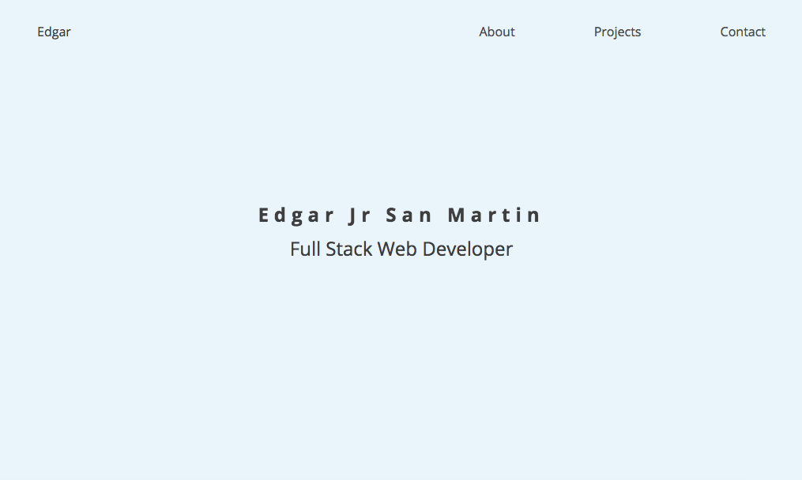

# FCC-Portfolio-Site
A Personal Portfolio Site I created for myself. Originally created in codepen.io and developed while completing freecodecamp. Could be seen [here](https://codepen.io/ej-sanmartin/pen/gdmJyp)

Though not the actual portfolio site I present to employers, I had made this site more "professional" looking. Professional include having a blue colour scheme, each section of the site fit into the screen(with the use of vh), and all the project tiles are of uniform lengths. It's a neat site made without any Javascript frameworks or libraries(think Angular or React) and I am proud that I as able to work with css keyframe animations, flexbox, and responsive design. I'll def be able to apply these design patterns in future portfolio sites I create, as I advance my career.

